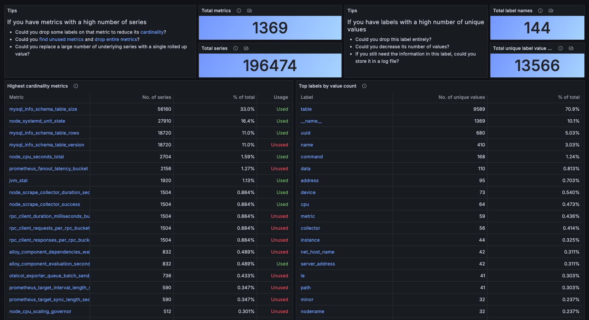

# Mimir Cardinality Analyzer

When running Mimir at scale, you inevitably wind up accumulating metrics that are completely unused. No dashboard references them and they're not used for alerting. These metrics however still consume resources both in terms of storage and ingest-capacity. In Grafana Cloud, you have Adaptive Metrics to surface this problem, but nothing similar exists for on-premises deployments. This tool identifies unused metrics in Mimir by cross-referencing what's actually stored with what's being used in dashboards and alerts. It exports the results as Prometheus metrics. This is intended as a self-hosted alternative to [Adaptive Metrics](https://grafana.com/docs/grafana-cloud/adaptive-telemetry/adaptive-metrics/) for Enterprise and open-source Mimir deployments.

On each analysis cycle (once per day by default), the tool:

1. **Discovers tenants** by querying the Mimir store-gateway for the list of active tenants.
2. **Analyzes dashboard usage** by running `mimirtool analyze grafana` against your Grafana instance to determine which metrics are referenced in dashboards.
3. Optionally analyzes alert usage by fetching provisioned alert rules from the Grafana API and checking which metrics appear in their expressions. This assumes the tenant ID is part of the datasource name to work, and is thus toggleable.
4. **Fetches top metrics by cardinality** for each tenant using Mimir's cardinality API (`/prometheus/api/v1/cardinality/label_values`), retrieving the top 100 metric names.
5. **Cross-references** the top metrics against dashboard and alert usage. Each metric is classified as either active or inactive and exported as a Prometheus gauge.

The output is a standard Prometheus gauge (`metric_active`) that you can visualize. Here's an example of what that looks like in Grafana:



The exported metric looks like:

```
metric_active{metric="some_metric_name", tenant="some-tenant"} 1
metric_active{metric="another_metric_name", tenant="some-tenant"} 0
```

A value of `1` means the metric is referenced in at least one dashboard or alert rule.

## Configuration

The tool is configured through a YAML file:

```yaml
grafana:
  url: "https://grafana.example.com"
  tokenFrom: "GRAFANA_TOKEN"   # read the token from this environment variable
  # token: "glsa_..."          # or specify it directly (not recommended)
  # insecure: false            # skip TLS verification (default: false)

mimir:
  querierUrl: "http://mimir-querier:8080"
  storeGatewayUrl: "http://mimir-store-gateway:8080"

http:
  host: "0.0.0.0"
  port: 8080
```

## CLI Usage

| Flag | Default | Description |
|---|---|---|
| `--config`, `-c` | (required) | Path to the YAML configuration file |
| `--output-dir`, `-o` | `.` | Directory for intermediate files produced by `mimirtool` |
| `--interval`, `-i` | `86400` | Seconds between analysis cycles (default is 24 hours) |
| `--disable-alert-correlation` | `false` | Skip alert rule analysis entirely |

For example, to run every 6 hours with alert correlation disabled:

```bash
cargo run -- --config config.yaml --interval 21600 --disable-alert-correlation
```

## Deploying to Kubernetes

A minimal installation looks like this:

```bash
helm install mimir-cardinality-analyzer oci://quay.io/duk4s/mimir-cardinality-analyzer-helm \
  --set grafana.url="https://grafana.example.com" \
  --set grafana.tokenFrom="GRAFANA_TOKEN" \
  --set mimir.querierUrl="http://mimir-querier:8080" \
  --set mimir.storeGatewayUrl="http://mimir-store-gateway:8080" \
  --set extraEnv[0].name="GRAFANA_TOKEN" \
  --set extraEnv[0].valueFrom.secretKeyRef.name="grafana-secret" \
  --set extraEnv[0].valueFrom.secretKeyRef.key="token"
```

See [values.yaml](./helm/mimir-cardinality-analyzer/values.yaml) for a full set of configurable values.

## Dashboards

The included dashboards are modified versions of the [CERN](https://github.com/cerndb/grafana-mimir-cardinality-dashboards/tree/main/dashboards) dashboards. They require two datasources in Grafana:

1. **Infinity** (`yesoreyeram-infinity-datasource`) — pointed at your Mimir querier. The dashboards use this to query Mimir's cardinality API directly (e.g. `/prometheus/api/v1/cardinality/label_values`). You'll need to install the [Infinity plugin](https://grafana.com/grafana/plugins/yesoreyeram-infinity-datasource/) and create a datasource with the base URL set to your Mimir querier.

2. **Prometheus** — pointed at wherever you're scraping the analyzer's `/metrics` endpoint. This is used to query the `metric_active` gauge that the tool exports, which is what powers the "used vs. unused" view.

When importing the dashboards, Grafana will prompt you to map both datasource variables to the ones you've configured.

## Metrics

### Analysis

| Metric | Type | Labels | Description |
|---|---|---|---|
| `metric_active` | Gauge | `metric`, `tenant` | `1` if the metric is referenced in a dashboard or alert, `0` otherwise |
| `analysis_errors_total` | Counter | `task` (`cycle`, `tenant`), `tenant` (only when `task=tenant`) | Count of analysis failures, per cycle or per tenant |
| `analysis_cycles_total` | Counter | `status` (`success`, `failure`) | Count of completed analysis loop iterations |
| `tenants_discovered_total` | Gauge | — | Number of tenants found during the latest discovery |
| `last_successful_analysis_timestamp` | Gauge | — | Unix timestamp of the last successful analysis cycle |

### External dependencies

| Metric | Type | Labels | Description |
|---|---|---|---|
| `external_request_duration_seconds` | Histogram | `target` (`store-gateway`, `querier`, `grafana`) | Latency of outbound HTTP requests |
| `external_request_failures_total` | Counter | `target` | Count of failed outbound HTTP requests |
| `mimirtool_executions_total` | Counter | `command` (`analyze_grafana`, `analyze_prometheus`), `status` (`success`, `failure`) | Count of mimirtool subprocess invocations |
| `mimirtool_duration_seconds` | Histogram | `command` | Duration of mimirtool subprocess executions |

### HTTP server

| Metric | Type | Labels | Description |
|---|---|---|---|
| `http_requests_total` | Counter | `endpoint` | Count of HTTP requests per endpoint |
| `http_request_duration_seconds` | Histogram | `endpoint` | Latency of HTTP request handling per endpoint |

### Process

| Metric | Type | Labels | Description |
|---|---|---|---|
| `process_start_time_seconds` | Gauge | — | Process start time as Unix epoch seconds |
| `build_info` | Gauge | `version` | Always `1`; the `version` label carries the application version |

## Limitations

- Only the top 100 metrics by cardinality are analyzed per tenant. Metrics outside that window are not evaluated.
- Alert rule matching relies on datasource names containing the tenant identifier, which assumes a naming convention in your Grafana datasource setup. If this doesn't match your setup, use `--disable-alert-correlation` to skip it.
